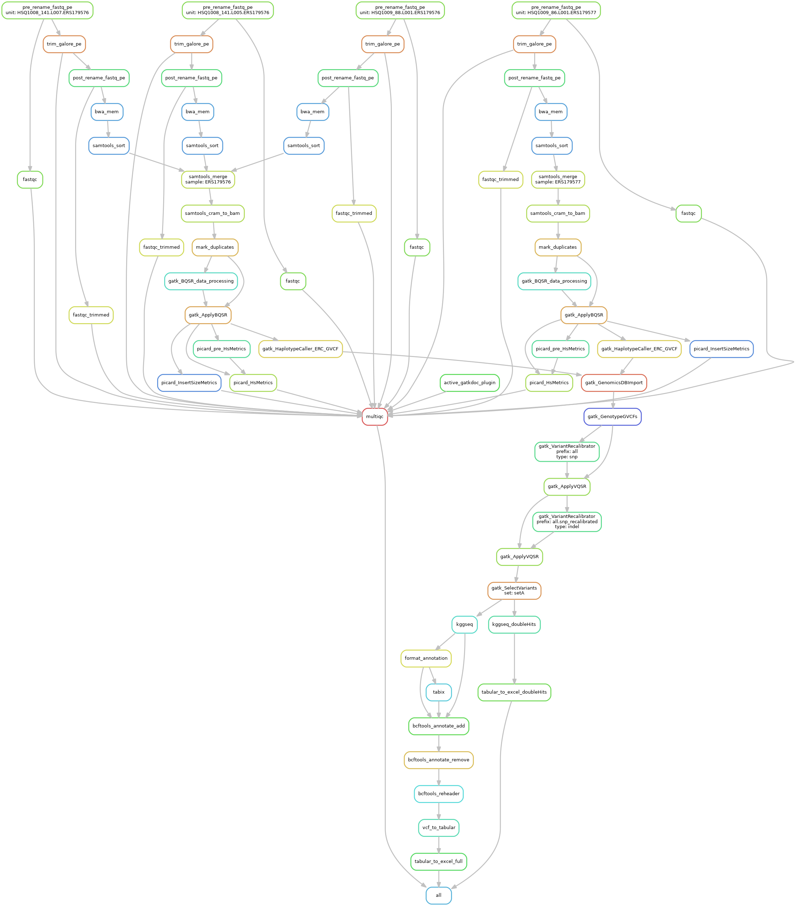

# DiVA exome
Snakemake pipeline to identify genomic variants from exome sequencing data, using GATK4 
variant calling according to BroadInstitute best practices.  

## Requirements
The pipeline's requirements are specified into the requirements.txt file and 
packages dependency are resolved using conda.

#### GATK note
Due to license restrictions, this project cannot install GATK directly. To  
fully install GATK, you must download a licensed copy of GATK from the Broad  
Institute (https://www.broadinstitute.org/gatk/download/) and call  
`gatk-register /path/to/GenomeAnalysisTK[-$PKG_VERSION .tar.bz2|.jar]`    
which will copy GATK into your conda environment.

## Getting started  
You can install the pipeline through [Solida](https://pypi.org/project/solida/).  
In that case will be available a bash script, _**run.project.sh**_, to 
facilitate the workflow execution, otherwise clone the repository and follow 
the instructions below:  

To activate the virtual environment:  
```bash
source activate _project_name_
```

To run the pipeline with test data:  
```bash
snakemake --cores 10 --latency-wait 30 --configfile config.testdata.json
```

An example on how to run the pipeline on CRS4 cluster:  
```bash
snakemake --cores 10 --latency-wait 30 --configfile config.testdata.json --drmaa ' -S /bin/bash -l entu=1 -l centos7=1 -l exclusive=1 -V' --jobs 32
```

To save the DAG's draw as a pdf file :  
```bash
snakemake --configfile config.testdata.json --dag | dot -Tpdf > dag_testdata.pdf
```

## Workflow
DiVA workflow comprise three analysis phases:
 * _SingleSample_, from fastq to gvcf  
 * _Joint_, from all the gvcf toghether to a recalibrated vcf  
 * _Annotation_, to produce a callset ready for downstream genetic analysis.  
  
For all this three phases, DiVA has a specific Snakefile labelled in the 
same way.  
_Snakefile_ is the default one and is the sum of _Snakefile.single_samples_only_ 
and _Snakefile.joint_

The annotation step makes use of GATK [SelectVariants](https://software.broadinstitute.org/gatk/documentation/tooldocs/3.8-0/org_broadinstitute_gatk_tools_walkers_variantutils_SelectVariants.php) 
and [KGGSeq](http://grass.cgs.hku.hk/limx/kggseq/)

The annotation step expects to found in the config file:
 * a path to the recalibrated vcf  
 * a way to select samples from the vcf above, using one of the options of 
 SelectVariants (see: -se, -sn, -sf)  
 * a path to a ped file  
 * a path to a KGGSEq installation directory  
 
The example below refer to the run_project.sh script, use a sample_file 
labelled set1 in the config file and create a workdir with label set1 
```bash
./run.project.sh -s Snakefile.annotation -c config.yaml -w set1 -p '--config sample_set=set1'
```


## Expected config file
Expects a json config file with the following structure, assuming that the
desired reference sequence is some genome
to be found under the given path, and two units A and B have been sequenced with Illumina.

```
{
    "references": {
        "genome": "path/to/genome.fasta"
    },
    "samples": {
        "A": ["A"],
        "B": ["B"]
    },
    "units": {
        "A":
            ["path/to/A_R1.fastq.gz", "path/to/A_R2.fastq.gz"],
        "B":
            ["path/to/B.fastq.gz"]
    },
    "known_variants": {
        "dbsnp": "path/to/dbsnp.vcf",
        "hapmap": "path/to/hapmap_3.3.vcf",
        "g1k": "path/to/1000G_phase1.snps.high_confidence.vcf",
        "omni": "path/to/1000G_omni2.5.vcf",
        "mills": "path/to/Mills_and_1000G_gold_standard.indels.vcf"
    },
    "platform": "Illumina",
    "heterozygosity": 0.001,
    "indel_heterozygosity": 1.25E-4
}
```

Note the separation between samples and units that allows to have more than
one sequencing run for each sample, or multiple lanes per sample.

